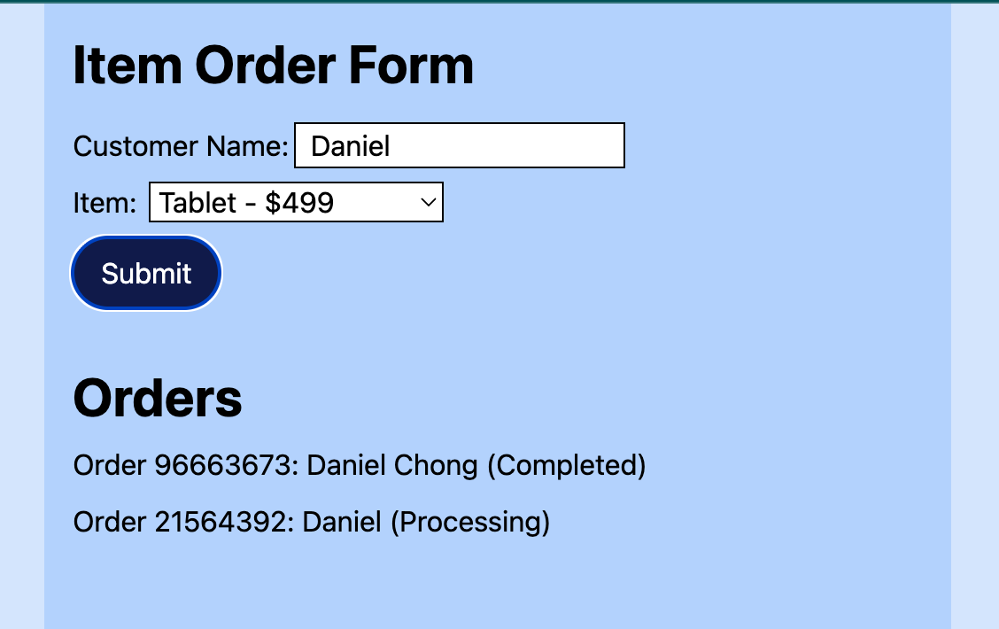

# Project for Datacom interview - Daniel Chong

The frontend was build in React with Vite, backend was with Hono.



## Installation

### Frontend

```
cd frontend
bun install
```

### Backend

```
cd backend
bun install
```

## Running Project

### Frontend

```
cd frontend
bun dev
```

### Backend

```
cd backend
bun dev
```

## Requirement Doc

### Task Description

Build a simple order processing interface with live status updates.

### Requirements

### Frontend (React)

1. Order Form
   - Input for customer name
   - Dropdown for product selection (4 items):
   ```
   const PRODUCTS = [
   { id: 1, name: &#39;Laptop&#39;, price: 999 },
   { id: 2, name: &#39;Phone&#39;, price: 699 },
   { id: 3, name: &#39;Headphones&#39;, price: 199 },
   { id: 4, name: &#39;Tablet&#39;, price: 499 },
   ];
   ```

   - &quot;Submit Order&quot; button
2. Orders List
   - Display all submitted orders with their id, client’s name and current status
     (Pending, Processing, Completed)
   - Automatically update the status without a page refresh

### Backend (Node.js)

1. Order Processing
   - Submitted orders start with the status Pending
   - Automatically transition to Processing after 2 seconds
   - Automatically transition to Completed after another 8 seconds

### Constraints

- Limit task completion to 2 hours.
- Use mocked data
- No need to deploy the apps. Local start is enough

### Deliverables

- React frontend with live status updates
- NodeJS backend

- Code written in TypeScript
- Submit the task as a public GitHub repo link
